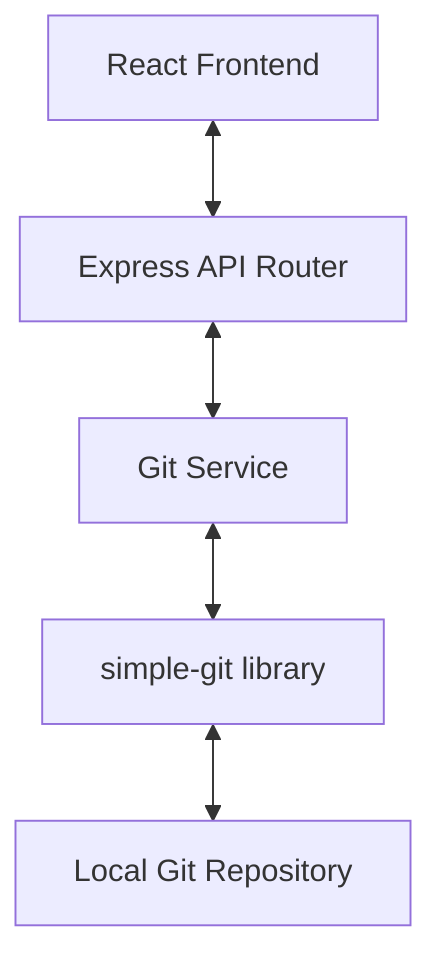

# Gitty Architecture

Gitty is built as a monorepo with a React frontend and an Express backend. It uses a "Checkout, Amend, Replay" strategy for editing Git history.

### System Diagram

### Component Breakdown

#### Frontend (client/)
- **App.tsx**: Main orchestrator, handles state for repo management and selection.
- **CommitList.tsx**: Visualizes the Git log.
- **CommitDetails.tsx**: Handles the logic for initiating edits and rebasing.
- **DiffViewer.tsx**: High-performance (virtualized-ready) diff view with inline editing.
- **ConflictResolver.tsx**: 3-way merge UI for handling rebase conflicts.
- **BranchSelector.tsx**: Dropdown for switching branches.

#### Backend (server/)
- **GitService.ts**: The core engine. It executes all Git commands via `simple-git`.
- **git.ts (Routes)**: Maps HTTP requests to GitService methods.
- **types/**: Shared TypeScript types for consistent data flow.

### Core Logic: History Rewriting
The critical path for editing an old commit follows this sequence:
1. `git checkout <SHA>` (Move to the past)
2. `git commit --amend` (Modify the past)
3. `git rebase --onto <NewSHA> <OldSHA> <Branch>` (Re-bridge the gap to the present)
