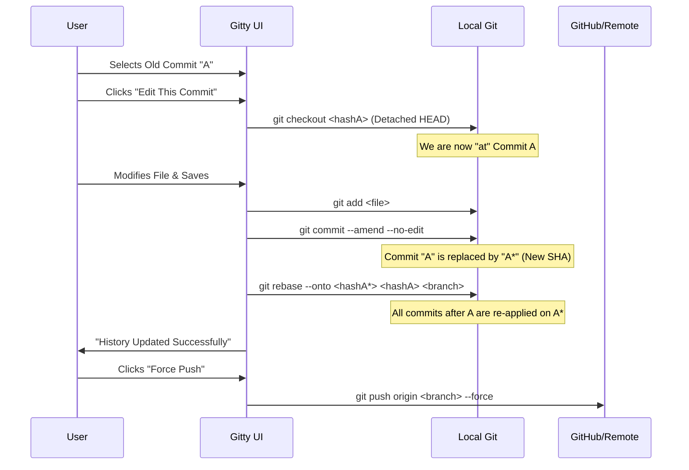

# Gitty: The "Edit Any Commit" Workflow

Yes, our system is designed to achieve exactly what you've described: **changing the past so it looks like the edit was always there.**

The technical name for this is **"Checkout, Amend, Replay"**. Here is exactly how Gitty performs those steps when you edit an old commit:

### 1. The Process Flow

### 2. Step-by-Step Breakdown

| Step | What Happens | Why we do it |
| :--- | :--- | :--- |
| **1. Checkout** | `git checkout <hash>` | We jump back in time to the exact moment that commit was made. |
| **2. Amend** | `git commit --amend` | We "inject" your new changes into that old commit. This creates a brand new version of that commit (A becomes A*). |
| **3. Rebase** | `git rebase --onto` | This is the "magic" step. We take all the work you did *after* that commit and glue it on top of the new edited version. |
| **4. Force Push** | `git push --force` | Since we changed the past, the remote server (GitHub) will realize the history is different. This command tells the server to accept our new, corrected history. |

### 3. Does it look like I edited it back then?
**Yes.** Because we use `--amend` and then `rebase`, the final history will show:
1. The **same** commit message.
2. The **filtered** changes (as if you never made the mistake).
3. The **original** author date.

All subsequent commits remain in order. To any outside observer (or a PR reviewer), it looks like you perfectly implemented the feature on the first try.
